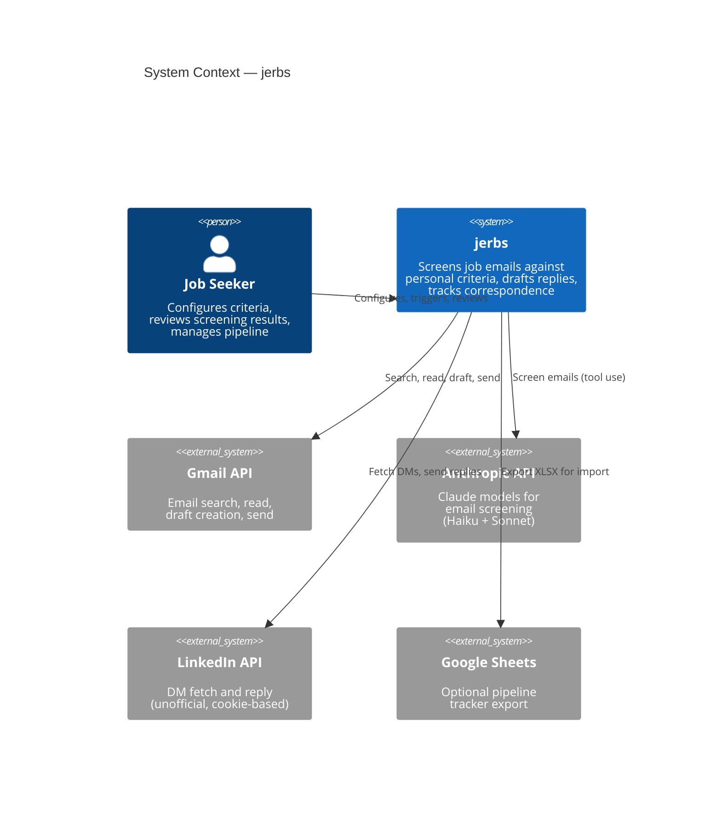
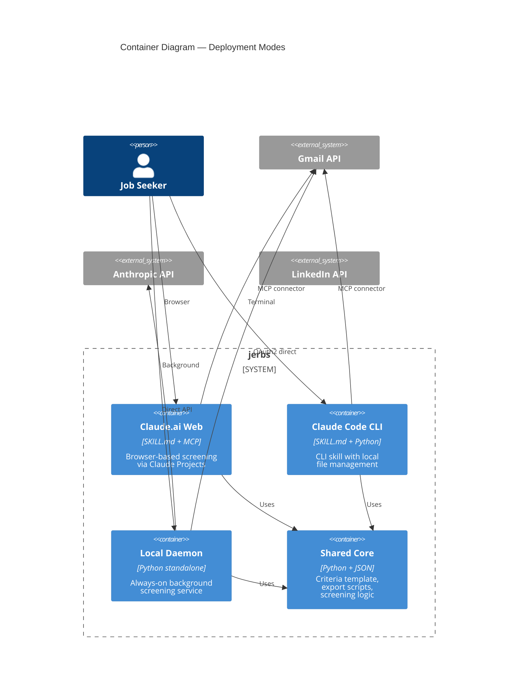
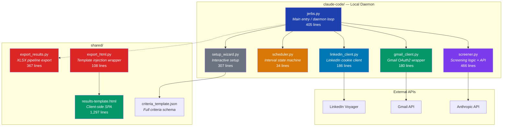
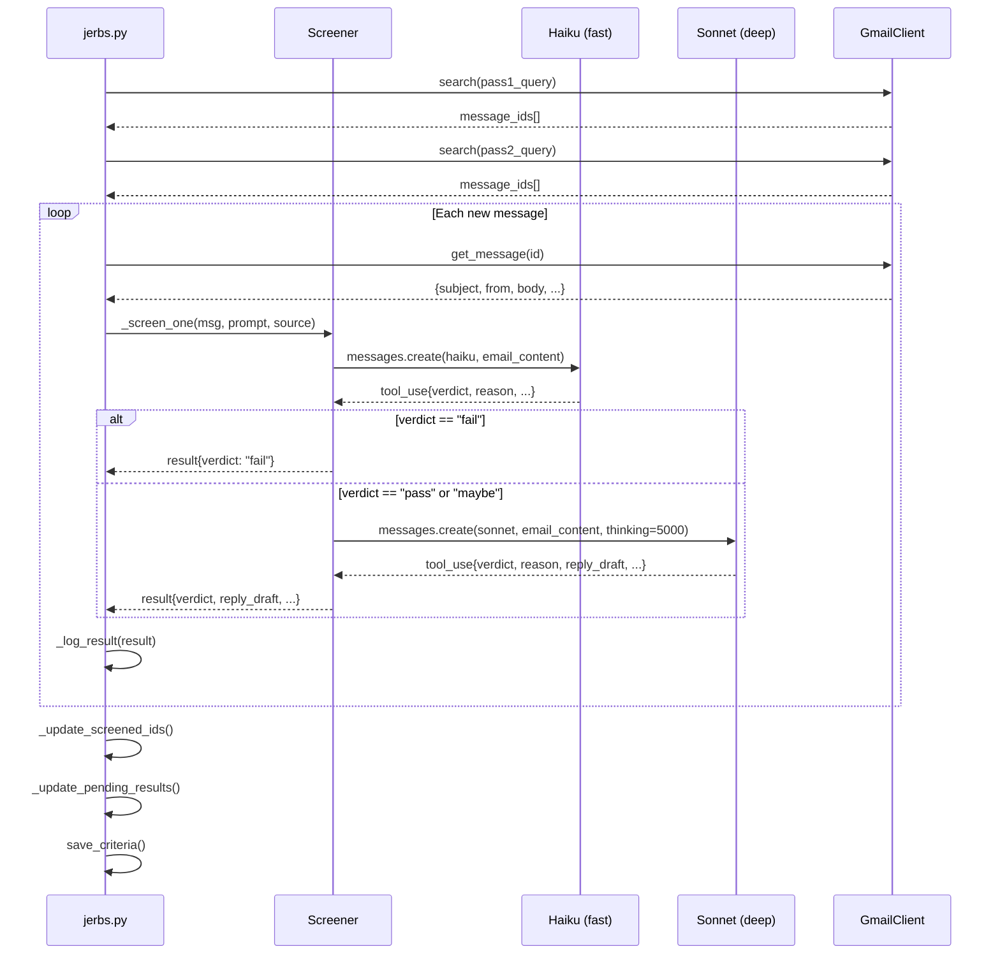
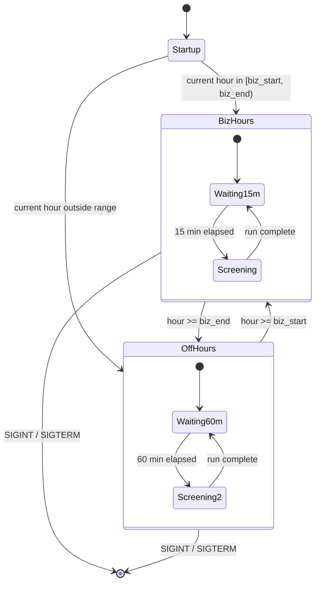
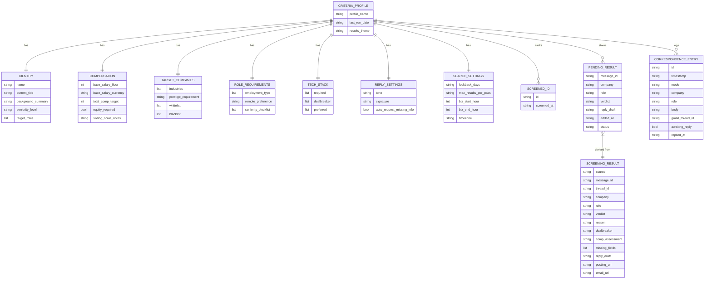
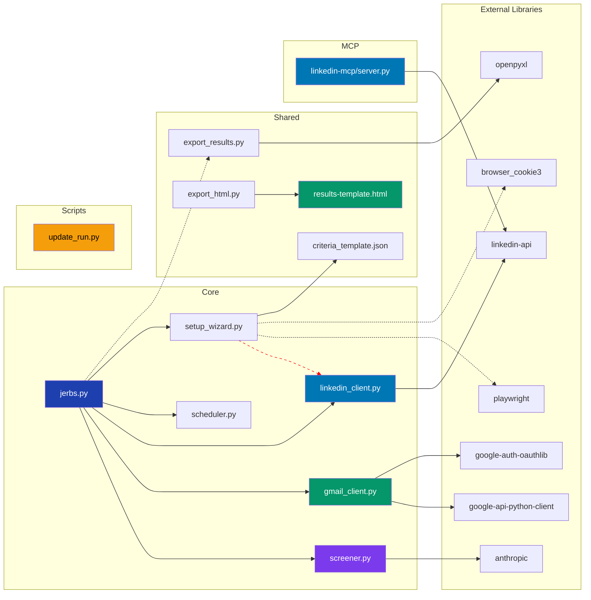
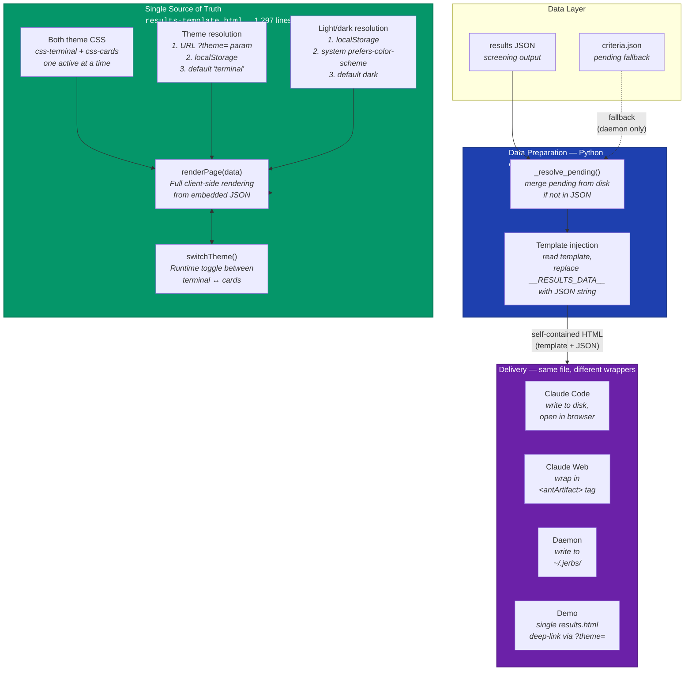

# Jerbs Architecture Analysis

Senior architect review — 2026-04-03.

This document covers the current architecture, visual diagrams, identified issues, and
recommended improvements.

---

## Table of Contents

1. [System Overview](#system-overview)
2. [Codebase Metrics](#codebase-metrics)
3. [Architectural Diagrams](#architectural-diagrams)
4. [What's Done Well](#whats-done-well)
5. [Architectural Issues & Recommendations](#architectural-issues--recommendations)
6. [Prioritized Roadmap](#prioritized-roadmap)

---

## System Overview

Jerbs is a multi-deployment job email screening tool that:
- Scans Gmail in 2 passes (job digests + direct outreach) plus optional LinkedIn DMs
- Screens each email against user-defined criteria using the Anthropic API
- Uses a two-tier model strategy (Haiku fast-path for clear fails, Sonnet + extended thinking for ambiguous cases)
- Generates draft replies for pass/maybe verdicts
- Exports results to interactive HTML and/or pipeline-tracking XLSX
- Supports three deployment modes: Claude.ai browser, Claude Code CLI, and standalone local daemon

---

## Codebase Metrics

| Category | Files | Lines |
|---|---|---|
| Core modules (`claude-code/`) | 6 | 1,578 |
| Shared scripts (`shared/scripts/`) | 2 | 475 |
| Shared templates (`shared/templates/`) | 1 | 1,297 |
| LinkedIn MCP server | 1 | 236 |
| Utility scripts (`scripts/`) | 2 | ~195 |
| Unit tests (`tests/unit/`) | 14 | 5,489 |
| Red team harness (`tests/redteam/`) | 1 | 274 |
| Skill definitions | 2 | 1,592 |
| CI workflows | 5 | ~120 |
| **Total** | **~33** | **~10,790** |

Test-to-source ratio: ~2.5:1 (healthy).
Coverage: 100% enforced in CI.

---

## Architectural Diagrams

All diagrams use Mermaid syntax. They render natively on GitHub, in VS Code (with the
Mermaid extension), and in most modern markdown viewers.

### 1. System Context (C4 Level 1)

Who uses jerbs and what external systems does it depend on?



### 2. Deployment Modes (C4 Level 2)

Three distinct deployment containers sharing core logic:



### 3. Component Diagram — Local Daemon (`claude-code/`)

Internal module structure and dependencies:



### 4. Data Flow — Screening Pipeline

End-to-end flow of a single screening run:

```mermaid
flowchart TB
    start([Start screening run]) --> load[Load criteria.json]
    load --> summary[Print criteria summary]
    summary --> p1

    subgraph "Pass 1 — Job Alert Digests"
        p1[Gmail search:<br/>linkedin.com, indeed.com,<br/>subject keywords] --> dedup1{Already<br/>screened?}
        dedup1 -->|Yes| skip1[Skip]
        dedup1 -->|No| fetch1[Fetch full message]
    end

    subgraph "Pass 2 — Direct Outreach"
        fetch1 --> p2[Gmail search:<br/>recruiter phrases,<br/>exclude alerts/noreply]
        p2 --> dedup2{Already<br/>screened?}
        dedup2 -->|Yes| skip2[Skip]
        dedup2 -->|No| fetch2[Fetch full message]
    end

    subgraph "Pass 3 — LinkedIn DMs (optional)"
        fetch2 --> p3{LinkedIn<br/>enabled?}
        p3 -->|Yes| li_fetch[Fetch recent conversations]
        p3 -->|No| collect
        li_fetch --> dedup3{Already<br/>screened?}
        dedup3 -->|Yes| skip3[Skip]
        dedup3 -->|No| fetch3[Fetch full message]
        fetch3 --> collect
    end

    skip1 --> p2
    skip2 --> p3
    skip3 --> collect

    collect[Collect all new messages] --> batch{Interactive<br/>or batch?}

    batch -->|"Interactive (--once)"| realtime
    batch -->|"Daemon (>3 msgs)"| batchapi

    subgraph "Two-Tier Screening"
        realtime[Real-time API path]
        batchapi[Batch API path<br/>50% cost reduction]

        realtime --> haiku1[Stage 1: Haiku<br/>fast-path screening]
        batchapi --> haiku2[Stage 1: Haiku batch<br/>all emails at once]

        haiku1 --> verdict1{Verdict?}
        haiku2 --> verdict2{Verdict?}

        verdict1 -->|fail| done1[Accept Haiku fail]
        verdict1 -->|pass/maybe| sonnet1[Stage 2: Sonnet<br/>+ extended thinking]

        verdict2 -->|fail| done2[Accept Haiku fail]
        verdict2 -->|pass/maybe| sonnet2[Stage 2: Sonnet batch<br/>+ extended thinking]

        sonnet1 --> result1[Final result]
        sonnet2 --> result2[Final result]
        done1 --> result1
        done2 --> result2
    end

    result1 --> persist
    result2 --> persist

    subgraph "State Persistence"
        persist[Update state] --> ids[Add to screened_message_ids<br/>prune >60 days]
        ids --> pending[Merge into pending_results<br/>prune >14 days]
        pending --> corr[Prune correspondence log<br/>>90 days closed]
        corr --> save[Save criteria.json]
    end

    save --> output{Export?}
    output -->|HTML| html[export_html.py<br/>Template injection]
    output -->|XLSX| xlsx[export_results.py<br/>Pipeline tracker]
    output -->|None| fin([Done])
    html --> fin
    xlsx --> fin
```



### 5. Sequence Diagram — Single Email Screening (Real-time)



### 6. State Diagram — Daemon Scheduler



### 7. Entity Relationship — Data Model



### 8. Module Dependency Graph

What imports what — showing coupling between modules:



Note: The dashed red line from `jerbs.py` → `export_results.py` uses a runtime `sys.path.insert()` hack, not a proper import.

### 9. Rendering Pipeline

All deployment modes share a single rendering pipeline. The Python wrapper (`export_html.py`)
handles data preparation (pending resolution from disk), then injects the results JSON into
the client-side template. The template is a self-contained SPA that renders both themes at
runtime with light/dark mode support.



---

## What's Done Well

These are genuine architectural strengths worth preserving:

1. **Two-tier model strategy** — Haiku fast-path for clear fails (~$0.001/email), Sonnet + extended thinking only for ambiguous cases. This is a cost-optimal design that most AI apps get wrong by over-calling expensive models.

2. **Batch API integration** — Daemon runs use the Anthropic Batch API for >3 emails, cutting costs 50%. Interactive runs use real-time API with streaming callbacks. The `_build_api_params()` shared helper prevents drift between the two paths.

3. **Prompt caching** — `cache_control: {"type": "ephemeral"}` on the system prompt means multi-email runs reuse the cached prompt across calls. Combined with the criteria-hash-based prompt cache on the `Screener` instance, this eliminates redundant work at both the application and API layers.

4. **Tool use for structured output** — Using Claude's native tool use (`record_screening_result`) instead of JSON string parsing eliminates parse failures and produces typed output.

5. **100% test coverage, enforced in CI** — Not just a badge — `--cov-fail-under=100` in the test workflow means PRs literally cannot merge with uncovered code.

6. **Red team security testing** — A dedicated promptfoo-based prompt injection test harness with 50 attack scenarios, run against PRs via `/redteam` comment trigger. The `extract_draft_reply()` function correctly isolates the recruiter-facing text from internal verdict text to avoid false positives. This is more security rigor than most production AI applications have.

7. **Three-tier state pruning** — Screened IDs (60-day TTL), pending results (14-day TTL), and correspondence log (90-day TTL for closed threads). This prevents unbounded state growth, which is a common oversight in long-running automation.

8. **Clean deployment mode separation** — `claude-code/` (daemon), `claude-web/` (browser), `shared/` (common) with build scripts to package the web version. Each mode has appropriate state management.

---

## Architectural Issues & Recommendations

### Issue 1: No Python package structure (HIGH)

**Current state:** Flat scripts with `sys.path.insert()` hacks in 3+ places. No `__init__.py`, no package definition in `pyproject.toml`, no entry points.

```python
# jerbs.py line 177 — runtime path manipulation
sys.path.insert(0, str(Path(__file__).parent.parent / "shared" / "scripts"))
from export_results import export_to_xlsx

# Every test file:
sys.path.insert(0, str(Path(__file__).parent.parent.parent / "claude-code"))
```

**Why it matters:** This is brittle, IDE-unfriendly (no autocomplete/go-to-definition), and makes it impossible to install the package or run it outside the repo root. It also blocks proper dependency resolution.

**Recommendation:** Define a proper package in `pyproject.toml` with a `src/` layout:

```
src/
  jerbs/
    __init__.py
    cli.py            (current jerbs.py)
    screener.py
    gmail_client.py
    linkedin_client.py
    scheduler.py
    setup_wizard.py
    config.py          (new — centralized paths)
    state.py           (new — extracted from jerbs.py)
    export/
      __init__.py
      html.py          (current export_html.py)
      xlsx.py          (current export_results.py)
```

Add to `pyproject.toml`:
```toml
[project]
name = "jerbs"
version = "1.0.0"
requires-python = ">=3.11"

[project.scripts]
jerbs = "jerbs.cli:main"
```

---

### Issue 2: LinkedIn normalization duplicated (MEDIUM)

**Current state:** `_normalize_event()` is copy-pasted identically between:
- `claude-code/linkedin_client.py` lines 129–165
- `linkedin-mcp/server.py` lines 71–107

The auth logic (`_authenticate` / `_get_api`) is also 90% identical between the two.

**Why it matters:** Bug fixes or format changes need to be applied in both places. They will inevitably drift.

**Recommendation:** Extract shared LinkedIn logic into `src/jerbs/linkedin_common.py`:
```python
# shared normalization + auth
def normalize_linkedin_event(event, conv_id, message_id) -> dict: ...
def load_linkedin_cookies(path) -> tuple[str, str]: ...
def create_linkedin_api(li_at, jsessionid) -> Linkedin: ...
```

Both `linkedin_client.py` and `linkedin-mcp/server.py` import from this shared module.

---

### Issue 3: Configuration paths are scattered and inconsistent (MEDIUM)

**Current state:** Hardcoded path constants in 6 different files, with two different base directories depending on deployment mode:

| File | Base path |
|---|---|
| `jerbs.py` | `~/.jerbs/` |
| `gmail_client.py` | `~/.jerbs/` |
| `linkedin_client.py` | `~/.jerbs/` |
| `setup_wizard.py` | `~/.jerbs/` |
| `update_run.py` | `~/.claude/jerbs/` |
| `linkedin-mcp/server.py` | `~/.jerbs/` |

**Why it matters:** If you need to change the base path, you touch 6 files. The daemon vs CLI path split is intentional but not centralized — it's implicit knowledge.

**Recommendation:** Create `config.py`:
```python
from pathlib import Path

class JerbsConfig:
    def __init__(self, base_dir: Path | None = None):
        self.base = base_dir or Path.home() / ".jerbs"

    @property
    def criteria_path(self) -> Path:
        return self.base / "criteria.json"

    @property
    def gmail_credentials(self) -> Path:
        return self.base / "credentials.json"

    # ... etc
```

---

### Issue 4: ~~`export_html.py` is a 1,354-line monolith~~ RESOLVED

**Resolved:** The Python HTML generator was replaced with a thin ~108-line wrapper that
injects results JSON into the client-side SPA template (`results-template.html`). All
rendering logic — CSS, JS, card builders, theme switching — now lives in the template
as the single source of truth. The old approach had two complete rendering engines (Python
server-side + JS client-side) that had to be kept in sync. See the Rendering Pipeline
diagram below for the new architecture.

---

### Issue 5: `jerbs.py` has too many responsibilities (MEDIUM)

**Current state:** The 405-line main module handles CLI parsing, criteria I/O, logging, result logging, screening orchestration, export, pending results management, screened ID management with migration logic, correspondence pruning, summary printing, signal handling, and the daemon loop.

**Why it matters:** Hard to test individual concerns in isolation. The `_update_screened_ids()`, `_update_pending_results()`, `_load_pending_results()`, and `_prune_correspondence_log()` functions are pure state management that don't belong in the CLI entry point.

**Recommendation:** Extract into `state.py`:
```python
# state.py — criteria state management
def update_screened_ids(criteria, new_ids): ...
def update_pending_results(criteria, new_results): ...
def load_pending_results(criteria): ...
def prune_correspondence_log(criteria): ...
```

This also eliminates the duplication with `update_run.py` (see Issue 9).

---

### Issue 6: No formal interface for message sources (LOW-MEDIUM)

**Current state:** `GmailClient` and `LinkedInClient` share an implicit interface (`.search()`, `.get_message()`, `.send_reply()`, `.create_draft()`) but there's no Protocol, ABC, or type annotation enforcing it. `Screener.run()` accepts both via duck typing.

**Why it matters:** Nothing catches interface violations until runtime. Adding a new source (e.g., Outlook) has no contract to implement against.

**Recommendation:** Define a Protocol:
```python
from typing import Protocol

class MessageSource(Protocol):
    def search(self, query: str, max_results: int | None = None) -> list[dict]: ...
    def get_message(self, message_id: str) -> dict: ...
    def send_reply(self, thread_id: str, body: str, to: str = "", signature: str = ""): ...
    def create_draft(self, thread_id: str, body: str, to: str = "", signature: str = "") -> str: ...
```

---

### Issue 7: Criteria dict is untyped (LOW-MEDIUM)

**Current state:** The entire system passes `dict` for criteria. Keys are accessed by string literals everywhere (`criteria.get("compensation", {}).get("base_salary_floor")`) with no type checking.

**Why it matters:** Typos in key names are silent bugs. IDE support is minimal. The schema exists in `criteria_template.json` but isn't enforced at the code level.

**Recommendation:** Define TypedDicts or a Pydantic model matching the schema:
```python
class Compensation(TypedDict):
    base_salary_floor: int | None
    total_comp_target: int | None
    equity_required: bool
    sliding_scale_notes: str
    # ...
```

This is a gradual migration — start with the most-accessed sections (compensation, search_settings).

---

### Issue 8: Primitive logging (LOW)

**Current state:** A global `log()` function that prints + appends to a file. No log levels, no structured output, no rotation.

```python
def log(msg: str, path: Path = LOG_PATH):
    ts = datetime.now().strftime("%Y-%m-%d %H:%M:%S")
    line = f"[{ts}] {msg}"
    print(line)
    # ... write to file
```

**Why it matters:** Can't filter by severity. Can't redirect daemon logs without code changes. Log files grow unboundedly.

**Recommendation:** Replace with `logging` module:
```python
import logging
logger = logging.getLogger("jerbs")
# Configure with StreamHandler + RotatingFileHandler in main()
```

---

### Issue 9: `update_run.py` duplicates state logic (LOW)

**Current state:** `update_run.py` has its own `add_ids()` with screened ID migration logic that duplicates `jerbs.py._update_screened_ids()`. It uses a different criteria path (`~/.claude/jerbs/` vs `~/.jerbs/`).

**Why it matters:** Two implementations of the same migration logic. If the format changes, both need updating.

**Recommendation:** After Issue 5 (extracting `state.py`), have `update_run.py` import from it instead of reimplementing.

---

### Issue 10: No error recovery in daemon loop (LOW)

**Current state:** The daemon `while` loop calls `run_screen()` with no try/except. An unhandled exception crashes the process.

```python
while not stop_event.is_set():
    # ... wait ...
    criteria = load_criteria(criteria_path)
    run_screen(criteria, gmail, screener, ...)  # no try/except
```

**Why it matters:** Network errors, API rate limits, or transient failures kill the daemon permanently.

**Recommendation:** Wrap with retry logic:
```python
try:
    run_screen(...)
except Exception as e:
    log(f"Screening error (will retry next interval): {e}")
```

---

### Issue 11: Stale root `criteria_template.json` (TRIVIAL)

**Current state:** `criteria_template.json` exists at both the repo root and `shared/criteria_template.json`. The README says the root copy is "legacy."

**Recommendation:** Delete the root copy and update any references.

---

## Prioritized Roadmap

| Priority | Issue | Effort | Impact |
|---|---|---|---|
| 1 | Package structure (Issue 1) | Medium | Enables all other refactors, fixes imports |
| 2 | Extract `state.py` (Issue 5) | Small | Reduces `jerbs.py` complexity, fixes Issue 9 |
| 3 | LinkedIn dedup (Issue 2) | Small | Eliminates copy-paste maintenance burden |
| 4 | Centralize config (Issue 3) | Small | Single source of truth for paths |
| 5 | Add daemon error recovery (Issue 10) | Trivial | Prevents crashes from transient failures |
| 6 | Type the criteria dict (Issue 7) | Medium | Catches bugs at dev time, better IDE support |
| 7 | MessageSource Protocol (Issue 6) | Small | Contract for message source implementations |
| ~~8~~ | ~~Split `export_html.py` (Issue 4)~~ | ~~Medium~~ | **RESOLVED** — unified on template |
| 9 | Replace `log()` with logging (Issue 8) | Small | Standard logging with levels and rotation |
| 10 | Remove stale template (Issue 11) | Trivial | Housekeeping |

Items 1-5 could be done in a single focused PR. Items 6-10 are independent improvements
that can land incrementally.
